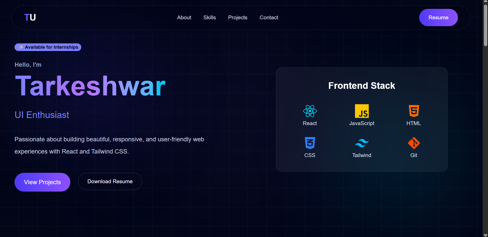

# 🚀 Personal Portfolio

A modern, responsive developer portfolio built with **React**, **Tailwind CSS**, and **Framer Motion**. It showcases my projects, technical skills, and contact information through a clean, interactive, and responsive user interface.



---

## ✨ Features

- 🎨 Modern glassmorphism-inspired UI
- 📱 Fully responsive design
- ⚡ Smooth animations using Framer Motion
- 💻 Featured projects with live demo & GitHub links
- ✨ Reusable component-based architecture
- 📬 Contact section with social links
- ⬆️ Smooth "Back to Top" functionality
- ♿ Built with accessibility and clean architecture in mind

---

## 🛠️ Tech Stack

### Frontend

- React
- JavaScript (ES6+)
- Tailwind CSS
- Framer Motion

### Tools

- Vite
- Git
- GitHub
- VS Code

---

## 📂 Project Structure

```text
src/
│
├── assets/
├── components/
│   ├── layout/
│   ├── sections/
│   └── ui/
│
├── data/
├── App.jsx
└── main.jsx
```

---

## 🚀 Getting Started


Move into the project folder

```bash
cd portfolio
```

Install dependencies

```bash
npm install
```

Start the development server

```bash
npm run dev
```

Build for production

```bash
npm run build
```

Preview the production build

```bash
npm run preview
```

---

## 📸 Sections

- Hero
- About
- Skills
- Projects
- Contact
- Footer

---

## 🌐 Live Demo

👉 **Portfolio:** https://your-portfolio-url.vercel.app

---

## 📬 Contact

**Email**

tarkeshwaruranw111@gmail.com

**LinkedIn**

https://linkedin.com/in/tarkeshwar-uranw-a66a5a31a

**GitHub**

https://github.com/tarkeshwaruranw

---

## 🎯 Future Improvements

- Dark / Light mode
- More featured projects
- Project detail pages
- Blog section
- Improved accessibility
- Performance optimization

---

## 🤝 Contributing

Contributions, suggestions, and feedback are always welcome.

Feel free to fork the repository and submit a pull request.

---

## 📄 License

This project is open for learning and inspiration.

---

## 👨‍💻 Author

**Tarkeshwar Uranw**

Frontend Developer passionate about building responsive, accessible, and modern web applications with React.

⭐ If you like this project, consider giving it a star!